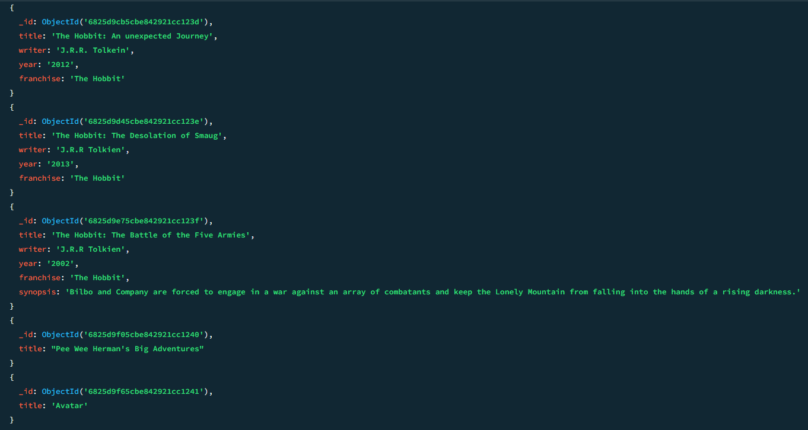
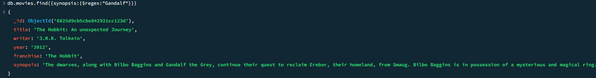

[←𝗚𝗼 𝗕𝗮𝗰𝗸](https://dtx-byte.github.io/Dxt_EDMPortfolio/)
# [Finals Lab Task 6 - MongoDBCRUD](https://github.com/Dtx-byte/Final-Lab-Task-6/raw/refs/heads/main/Assets/MongoDB%20Practice%20Task.docx)

This task focuses on performing fundamental MongoDB operations such as creating a database, inserting documents, and executing find, update, search, and delete actions within a collection.

## Step by Step Process

### Create a Database
- Start by creating or switching to a specific database
- The selected database becomes the active workspace for all upcoming operations

### Insert Documents
- Within the database, a collection is created
- Multiple documents are inserted into the collection, each containing structured data fields such as name, age, or address

### FIND Documents
- Display all documents stored in the collection
- Use filters to find specific documents based on certain values like name or ID

### UPDATE Documents
- Locate the document that needs modification using a condition (e.g., name or ID)
- Specify the field(s) to be changed and apply the update
- Confirm the update by checking the document again

### SEARCH Documents
- Use specific criteria to locate documents that match particular conditions (e.g., age greater than a value or status equals a specific string)
- Review the matched results for accuracy

### DELETE Documents
- Identify the document(s) to be removed using a condition
- Remove the document(s) from the collection
- Verify deletion by checking the collection contents

## Queries

## Create Database

## Insert Documents

## get all documents

## get all documents with `writer` set to "Quentin Tarantino"

## get all documents where `actors` include "Brad Pitt"

## get all documents with `franchise` set to "The Hobbit"

## get all movies released in the 90s

## get all movies released before the year 2000 or after 2010

## add a synopsis to "The Hobbit: An Unexpected Journey" 

## add a synopsis to "The Hobbit: The Desolation of Smaug" 

## add an actor named "Samuel L. Jackson" to the movie "Pulp Fiction"

## find all movies that have a synopsis that contains the word "Bilbo"

## find all movies that have a synopsis that contains the word "Gandalf"

## find all movies that have a synopsis that contains the word "Bilbo" and not the word "Gandalf"

## find all movies that have a synopsis that contains the word "dwarves" or "hobbit"

## find all movies that have a synopsis that contains the word "gold" and "dragon"

## delete the movie "Pee Wee Herman's Big Adventure"

## delete the movie "Avatar"

